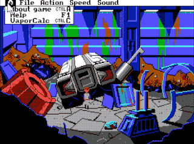

# SQ3 Working VaporCalc
A functional VaporCalc patch for Space Quest 3.

This patches Space Quest 3 so that clicking on the VaporCalc will move the beads around, That's it.

### Installation

Copy script.000, script.030 and view.027 in to the SQ3 game folder. This is only compatible with version 1.018, which is the most common version of SQ3.